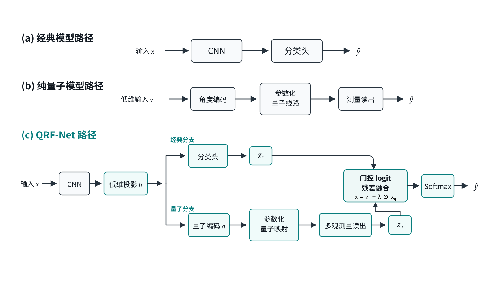

# QRF-Net

**Quantum Readout Residual Fusion for Parameter-Constrained Few-Shot Image Classification**  
**参数受限小样本图像分类的量子读出残差融合方法**

QRF-Net is a lightweight hybrid quantum-classical framework for few-shot image classification under a constrained trainable-parameter budget. A compact CNN first extracts local visual features, and a parameterized quantum circuit then operates on a low-dimensional bottleneck representation. The quantum readout is introduced as a **controlled residual complement** to the classical classification path through class-wise gated logit residual fusion.

This repository contains the main experiments on **MNIST**, **Fashion-MNIST**, and **CIFAR-10**, together with ablation studies on fusion strategies, complementary branches, Pauli-Z readout schemes, and quantum-circuit depth.

> **Reproducibility policy**  
> Every seed explicitly supplied through `--seeds` is included in the final aggregation. The released code does **not** perform metric-based post-hoc seed filtering. To reproduce a specific experimental protocol, pass the corresponding fixed seed list and hyperparameters explicitly.

---

## Overview


<p align="center">
  
</p>

<p align="center"><b>QRF-Net overall architecture.</b></p>

QRF-Net contains three main components:
1. a lightweight CNN for local feature extraction;
2. a parameterized quantum readout branch operating on low-dimensional bottleneck features;
3. a class-wise gated logit residual fusion module.

## Quantum Participation Paths

<p align="center">
  
</p>

<p align="center"><b>Comparison of classical, pure quantum, and QRF-Net hybrid paths.</b></p>

The experiments compare three types of participation patterns: a classical CNN path, a pure quantum path, and the proposed QRF-Net hybrid path. This design is used to distinguish the role of the quantum module as an independent classifier from its role as a complementary residual branch.

---

## Highlights

- Lightweight CNN + quantum residual readout branch
- Angle encoding and parameterized quantum circuits
- Data re-uploading in a low-dimensional feature space
- Multi-observable Pauli-Z readout
- Class-wise gated logit residual fusion
- Few-shot binary and multi-class classification
- Accuracy, Macro-F1, AUC, mean/std, and trainable-parameter statistics
- Fusion, branch, readout, and quantum-depth ablation experiments

---

## Repository Structure

```text
QRF-Net/
├── README.md
├── requirements.txt
├── .gitignore
├── figures/
│   ├── qrf_net_architecture.png
│   └── quantum_paths.png
├── qrf_net_main.py
├── qrf_net_mnist.py
├── qrf_net_cifar.py
├── qrf_net_ablation.py
└── qrf_net_q_layers_ablation.py
```

### Main scripts

| Script | Purpose |
| --- | --- |
| `qrf_net_main.py` | General QRF-Net experiments, including Fashion-MNIST tasks |
| `qrf_net_mnist.py` | MNIST experiment presets |
| `qrf_net_cifar.py` | CIFAR-10 experiment presets |
| `qrf_net_ablation.py` | Fusion, complementary-branch, and Pauli-Z readout ablations |
| `qrf_net_q_layers_ablation.py` | Quantum-circuit depth ablation |

Runtime-generated directories such as `data/`, `outputs/`, and `results/` should normally remain local and are ignored by Git.

---

## Environment

Python **3.9+** is recommended.

If a GPU is used, install a PyTorch build compatible with the local CUDA version first, and then install the remaining dependencies:

```bash
pip install -r requirements.txt
```

Main dependencies include:

- **PyTorch / torchvision** — model training and dataset loading
- **PennyLane** — parameterized quantum circuits and Pauli-Z readout
- **scikit-learn** — Accuracy, Macro-F1, and AUC evaluation
- **NumPy** — sampling and numerical utilities

---

## Data

MNIST, Fashion-MNIST, and CIFAR-10 are downloaded automatically through `torchvision`.

Default data directory:

```text
./data
```

A custom path can be specified with:

```bash
--data_root <path>
```

---

## Reproducibility and Seed Policy

A fixed seed list can be specified explicitly:

```bash
--seeds 0 1 2 3 4
```

All specified seeds are included when computing the final mean and standard deviation. No run is discarded or selected according to validation/test Accuracy, F1, AUC, or any other performance metric.

For exact reproduction, use the seed list and hyperparameters associated with the corresponding experiment configuration. If `--seeds` is omitted, the script uses its built-in default seed configuration.

---

## Example Usage

### Fashion-MNIST 2/4

Example task settings: `n = 10, 20, 100` samples per class.

```bash
python qrf_net_main.py \
  --dataset FashionMNIST \
  --class_ids 2 4 \
  --k_shots 10 20 100 \
  --val_shot 100 \
  --device cuda \
  --force_quantum_cpu \
  --summary_path outputs/fashion24_summary.json
```

### Fashion-MNIST 2/4/6

Example task settings: `n = 10, 50, 100` samples per class.

```bash
python qrf_net_main.py \
  --dataset FashionMNIST \
  --class_ids 2 4 6 \
  --k_shots 10 50 100 \
  --val_shot 100 \
  --device cuda \
  --force_quantum_cpu \
  --summary_path outputs/fashion246_summary.json
```

### MNIST 3/5

```bash
python qrf_net_mnist.py \
  --preset mnist35_stable \
  --device cuda \
  --summary_path outputs/mnist35_summary.json
```

### MNIST 3/5/8

```bash
python qrf_net_mnist.py \
  --preset mnist358_stable \
  --device cuda \
  --summary_path outputs/mnist358_summary.json
```

### CIFAR-10 0/1/8

Example task settings: `n = 10, 20, 50` samples per class.

```bash
python qrf_net_cifar.py \
  --preset cifar018 \
  --k_shots 10 20 50 \
  --val_shot 100 \
  --device cuda \
  --summary_path outputs/cifar018_summary.json
```

> `--force_quantum_cpu` can be used when PennyLane quantum-circuit execution is unstable on the GPU. The classical CNN can remain on CUDA while quantum-circuit evaluation is executed on the CPU.

---

## Ablation Experiments

### High-order Pauli-Z readout

The readout ablation compares the compact `Z + adjacent ZZ` configuration with higher-order Pauli-Z correlation terms.

```bash
python qrf_net_ablation.py \
  --preset fashion246 \
  --ablation readout \
  --readout_variants adjacent_zz all_triples all_quads \
  --k_shots 20 50 100 \
  --device cuda \
  --force_quantum_cpu \
  --resume \
  --summary_path outputs/readout_ablation_fashion246.json
```

### Fusion strategy

```bash
python qrf_net_ablation.py \
  --preset fashion246 \
  --ablation fusion \
  --k_shots 20 50 100 \
  --device cuda \
  --force_quantum_cpu \
  --resume \
  --summary_path outputs/fusion_ablation_fashion246.json
```

### Quantum-circuit depth

```bash
python qrf_net_q_layers_ablation.py \
  --preset fashion246 \
  --k_shots 20 50 100 \
  --q_layers 1 2 3 4 \
  --device cuda \
  --summary_path outputs/q_layers_ablation_fashion246.json
```

---

## Important Arguments

| Argument | Description |
| --- | --- |
| `--dataset` | Dataset: `MNIST`, `FashionMNIST`, or `CIFAR10` |
| `--class_ids` | Classes used in the task, e.g. `2 4 6` |
| `--k_shots` | Training samples per class |
| `--val_shot` | Validation samples per class |
| `--seeds` | Fixed seed list used for repeated runs |
| `--model` | Model variant, e.g. `hybrid`, `cnn_control`, `cnn_full`, `lenet`, `all` |
| `--readout_mode` | Main-script readout mode; available choices depend on the script |
| `--readout_variants` | Readout-ablation variants, e.g. `adjacent_zz`, `all_triples`, `all_quads` |
| `--fusion_mode` | Fusion strategy, e.g. `scalar`, `dynamic`, `logit_residual`, `logit_residual_gate` |
| `--q_layers` | Number of parameterized quantum-circuit layers |
| `--reuploads` | Number of data re-uploading stages |
| `--device` | `cuda` or `cpu` |
| `--force_quantum_cpu` | Execute the quantum branch on CPU |
| `--resume` | Skip already completed runs in supported ablation experiments |
| `--summary_path` | Output JSON path |

---

## Output

Depending on the script, each experiment writes a JSON summary containing:

- dataset and task configuration
- sample size and seed information
- model and training hyperparameters
- per-seed test metrics
- Accuracy, Macro-F1, and AUC statistics
- mean and standard deviation
- trainable-parameter counts

Large checkpoints, raw datasets, and temporary experiment outputs should not be committed to the public repository.

---

## Notes on Quantum Simulation

The current experiments use **PennyLane state-vector simulation** rather than noisy quantum hardware. Therefore, hardware-specific effects such as finite-shot sampling noise, readout errors, decoherence, and device-specific execution noise are not included in the main experiments unless explicitly enabled in future extensions.

The trainable-parameter count is reported as an explicit resource statistic. It should not be interpreted as a complete measure of quantum-model capacity; the expressive space of a parameterized quantum circuit also depends on its circuit structure, encoding scheme, entangling pattern, and accessible dynamical space.

---

## Citation

If you use this repository in academic work, please cite the corresponding manuscript:

```text
参数受限小样本图像分类的量子读出残差融合方法
Quantum Readout Residual Fusion Method for Parameter-Constrained Few-Shot Image Classification
```

A formal BibTeX entry can be added after publication.

---

## License

Please refer to the repository license for usage terms. If the repository is released under the MIT License, keep the `LICENSE` file in the repository root.
